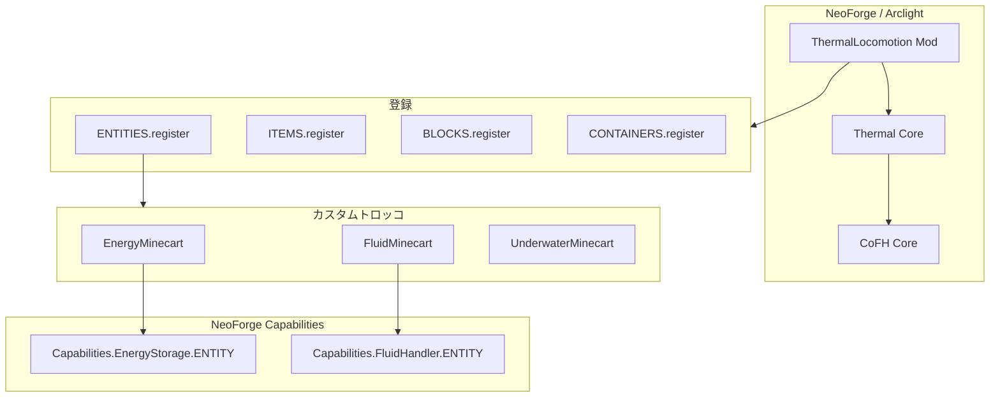

# Thermal Locomotion — Forge 1.20.1 → NeoForge 1.21.1 移植修正仕様書

| 項目 | 内容 |
|------|------|
| 対象 Mod | `thermal_locomotion` (Thermal Locomotion) |
| 目的 | Arclight NeoForge サーバー上で Thermal Series と連携して動作させる |
| Minecraft | 1.21.1 |
| サーバー | `arclight-neoforge-1.21.1-1.0.2-SNAPSHOT-0769551` |
| Mod ローダー | NeoForge `21.1.219` |
| Java | 21 |
| 作成日 | 2026-05-20 |
| **実装** | **コード移植は `a7a49a2` で完了。Arclight ランタイム検証が残作業。** |

---

## 1. エグゼクティブサマリー

### 1.1 現状

- リポジトリは **NeoForge 用 Gradle 構成**（`net.neoforged.gradle.userdev` 7.1.25）に移行済み。
- コミット `a7a49a2`（*Forge1.20.1→NeoForge1.21.1移植修正済み ビルドエラーを修正*）により、**`./gradlew compileJava` は成功**する。
- Java ソース 30 ファイルは `net.neoforged` API を使用。`net.minecraftforge` の直接参照は **残存なし**。
- ItemStack の旧 NBT API（`getTag()` / `getOrCreateTag()`）は **CoFHItemData 経由に置換済み**（エンティティ永続化用 `CompoundTag` は引き続き使用 — 後述）。

### 1.2 残作業の性質

ビルド通過 ≠ Arclight 本番検証完了。Free 枠で優先すべき残作業は次のとおり。

1. **Arclight サーバーでのランタイム検証**（エネルギー/流体トロッコ、GUI、ケイパビリティ、ワールド保存）— **未実施（手動）**
2. ~~**Data Generator の再実行**~~ — ✅ 2026-05-20 `./gradlew runData` 成功（72 ファイル再生成、内容差分なし）
3. **非推奨 API**（`ItemBlockRenderTypes`）の将来対応 — 参考 Mod と同様、現状は動作優先で据え置き可
4. **依存 Mod バージョン固定**（`cofh_core` / `thermal_core` が NeoForge 1.21.1 ビルドであること）— dev 環境で `11.0.2.0` / `11.0.7.0` 確認済み

### 1.3 ビルド検証（2026-05-20）

| コマンド | 結果 |
|---------|------|
| `./gradlew compileJava` | ✅ SUCCESS |
| `./gradlew runData` | ✅ SUCCESS |
| `./gradlew build` | ✅ SUCCESS（JAR 生成） |
| `./gradlew runServer` | ⚠️ Mod リストに `thermal_locomotion` ロード成功後、**Thermal Core** の `DisenchantmentFuelManager` でワールド生成失敗（§12.6 参照） |

---

## 2. 対象環境と依存関係

### 2.1 ランタイム要件

| コンポーネント | バージョン |
|---------------|-----------|
| Minecraft | 1.21.1 |
| NeoForge | ≥ 21.1.219 |
| Arclight | neoforge-1.21.1-1.0.2-SNAPSHOT 系 |
| cofh_core | 11.0.2.x（`gradle.properties`: `cofh_core_version=11.0.2`） |
| thermal (core) | 11.0.7.x（`thermal_core_version=11.0.7`） |

### 2.2 Mod 依存（`neoforge.mods.toml`）

- `minecraft` — 必須
- `neoforge` — 必須
- `cofh_core` — 必須
- `thermal` — 必須（Thermal Core）

Locomotion 単体ではブロック/アイテムの大半を **Thermal Core の DeferredRegister**（`ThermalCore.BLOCKS` / `ITEMS` / `ENTITIES` / `CONTAINERS`）経由で登録する。よって **Thermal Core NeoForge 版が必須**。

### 2.3 参考リポジトリ（移植パターン照合先）

| リポジトリ | 参照用途 |
|-----------|---------|
| `ThermalCoreForNeoForge` | 登録ヘルパー、`AugmentableMinecart`、`EnergyCellBlockItem` / `FluidCellBlockItem` の Data Components パターン、`RegisterCapabilitiesEvent` |
| `ThermalFoundationForNeoForge` | 素材・タグ・レシピ慣例 |
| `ThermalExpansionForNeoForge` | デバイス・ケイパビリティ登録 |
| `ThermalDynamicsForNeoForge` | `CoFHItemData`、`ItemBlockRenderTypes`、クライアント設定 |
| `ThermalIntegrationForNeoForge` | 連携 Mod 構成 |

### 2.4 公式ドキュメント

| 資料 | URL |
|------|-----|
| Forge → NeoForge 比較表 | https://docs.google.com/spreadsheets/d/1_DQELiPvCF0FmFfyU4opGDbWi7zv-bSl8ImZuh6645E/edit?gid=248444698 |
| Forge 旧 Wiki | https://forge.gemwire.uk/wiki/Main_Page |
| NeoForge Docs (1.21.1) | https://docs.neoforged.net/docs/1.21.1/ |
| Data Components | https://docs.neoforged.net/docs/1.21.1/items/datacomponents |
| Capabilities | https://docs.neoforged.net/docs/1.21.1/datastorage/capabilities |

---

## 3. アーキテクチャ概要



- **TNT 系トロッコ**: `ThermalCore.registerTNTMinecart()` で登録（Locomotion は ID とフラグのみ定義）。
- **エネルギー/流体トロッコ**: Locomotion が EntityType / Item / Menu / Capability を定義。
- **レール類**: Locomotion が Block を登録、タグ `#minecraft:rails` に追加。

---

## 4. Forge 1.20.1 → NeoForge 1.21.1 主要 API 変更一覧

本 Mod に影響する項目のみ抽出。詳細は比較表スプレッドシートを正とする。

| カテゴリ | Forge 1.20.1 | NeoForge 1.21.1 | 本 Mod での対応 |
|---------|--------------|-----------------|----------------|
| Mod エントリ | `@Mod` + `FMLJavaModLoadingContext.get().getModEventBus()` | `@Mod` + コンストラクタ `(ModContainer, IEventBus)` | ✅ `ThermalLocomotion.java` |
| パッケージ | `net.minecraftforge.*` | `net.neoforged.*` / `net.neoforged.neoforge.*` | ✅ 全面置換済み |
| mods.toml | `META-INF/mods.toml` | `META-INF/neoforge.mods.toml` | ✅ リネーム済み |
| Gradle | `forgegradle` | `net.neoforged.gradle.userdev` | ✅ `build.gradle` |
| Java | 17 | 21 | ✅ `gradle.properties` |
| ItemStack NBT | `stack.getTag()` / `getOrCreateTag()` / `getTagElement()` | **Data Components**（`DataComponents.CUSTOM_DATA` 等） | ✅ `CoFHItemData` ラッパー |
| ブロックアイテム BE データ | 同上 | `DataComponents.BLOCK_ENTITY_DATA` + `CustomData` | ⚠️ トロッコ Item は未使用（ブロック Cell 専用パターン） |
| Capabilities | `LazyOptional` + `ForgeCapabilities` + Attach イベント | `RegisterCapabilitiesEvent` + `stack/entity.getCapability(Capabilities.*)` | ✅ `TLocEntities.capabilitySetup` |
| エンティティ同期 | `defineSynchedData()` | `defineSynchedData(SynchedEntityData.Builder)` | ✅ 各 Minecart |
| GUI 登録 | `MenuScreens.register` in `FMLClientSetupEvent` | `RegisterMenuScreensEvent` | ✅ |
| エンティティレンダラ | `FMLClientSetupEvent` 内登録 | `EntityRenderersEvent.RegisterRenderers` / `RegisterLayerDefinitions` | ✅ |
| データ生成 | `GatherDataEvent`（Forge） | `GatherDataEvent`（NeoForge、パッケージ変更） | ✅ `TLocDataGen` |
| レシピ JSON パス | `data/<ns>/recipes/` | `data/<ns>/recipe/` | ✅ 移動済み |
| ルートテーブル | `loot_tables/blocks/` | `loot_table/blocks/` | ✅ |
| タグ（ブロック） | `tags/blocks/` | `tags/block/` | ✅ `rails.json` |
| 進捗（レシピ） | `advancements/recipes/` | `advancement/recipes/` | ✅ |
| FluidStack 構築 | `new FluidStack(fluid, amount)` | `fluidStack.copyWithAmount(n)` / 新 API | ✅ `FluidMinecart` |
| エンチャント API | `Enchantment#getMaxLevel()` 等 | `Holder<Enchantment>` + `registryAccess().holderOrThrow` | ✅ `UnderwaterMinecart` |
| アノテーション | `javax.annotation.*` | `org.jetbrains.annotations.*` | ✅ |
| RenderLayer | `ItemBlockRenderTypes.setRenderLayer` | **非推奨**（参考 Mod も継続使用） | ⚠️ 据え置き（§7.4） |

---

## 5. NBT と Data Components

### 5.1 Minecraft 1.20.5+ の原則

- **ItemStack のカスタムデータ**はルート NBT ではなく **Data Components** に格納される。
- バニラ例: ダメージ → `DataComponents.DAMAGE`、カスタム名 → `DataComponents.CUSTOM_NAME`。
- Mod 独自データ: 多くの場合 `DataComponents.CUSTOM_DATA`（`CustomData` ラッパー内の `CompoundTag`）。

### 5.2 CoFH 系列の抽象化（本 Mod の標準）

`cofh.lib.util.CoFHItemData`（CoFH Core 提供）が ItemStack ↔ CompoundTag の読み書きを担当する。**Locomotion は直接 `DataComponents` を触らず、この API を使う**（Thermal Dynamics / EnergyContainerItemAugmentable と同じ）。

| 操作 | 旧 Forge API | NeoForge 修正後 |
|------|-------------|----------------|
| 読取 | `stack.getTag()` | `CoFHItemData.getTag(stack)` |
| 書込 | `stack.getOrCreateTag()` | `CoFHItemData.updateTag(stack, consumer)` |
| サブタグ | `stack.getTagElement(TAG)` | `CoFHItemData.getTag(stack).getCompound(TAG)` |

### 5.3 ブロックアイテムとの使い分け（重要）

| アイテム種別 | 参照実装 | ストレージ |
|-------------|---------|-----------|
| Energy **Cell**（ブロック） | `EnergyCellBlockItem` | `DataComponents.BLOCK_ENTITY_DATA` |
| Energy **Minecart**（エンティティアイテム） | `EnergyMinecartItem` | `CoFHItemData`（`CUSTOM_DATA` 相当） |
| Fluid **Cell**（ブロック） | `FluidCellBlockItem` | `BLOCK_ENTITY_DATA` + `TAG_TANK_INV` |
| Fluid **Minecart** | `FluidMinecartItem` | `CoFHItemData` |

**仕様上の結論**: Locomotion のトロッコ Item を `BLOCK_ENTITY_DATA` に変更する必要は **ない**（参考: `EnergyContainerItemAugmentable` も `CoFHItemData` のみ）。BlockItem パターンへの変更は誤移植となる。

### 5.4 エンティティ・BlockEntity の NBT

`EnergyMinecart` / `FluidMinecart` の `readAdditionalSaveData` / `addAdditionalSaveData` 内の `CompoundTag` は **ワールド上のエンティティ保存**用であり、ItemStack Data Components とは別系統。**変更不要**（バニラ Entity の NBT 保存は 1.21.1 でも継続）。

### 5.5 ワールド移行・互換性

| リスク | 内容 | 推奨対応 |
|--------|------|---------|
| 旧 Forge 1.20.1 ワールド | ItemStack ルート `{tag:{...}}` 形式 | CoFH Core / Thermal Core 側の Data Fixer に依存。Locomotion 単独では対応不要 |
| トロッコ内蔵エネルギー/流体 | エンティティ NBT + アイテム `CoFHItemData` の二系統 | 設置・回収サイクルを Arclight 上でテスト |
| オーグメント | `AugmentableMinecart` が `TAG_AUGMENTS` を管理 | `keepAugments` 設定と併せて回収テスト |

---

## 6. Capabilities（AttachEvents 廃止）

### 6.1 旧 Forge パターン（廃止）

```java
// 廃止: CapabilityManager, @SubscribeEvent AttachCapabilitiesEvent, LazyOptional
event.addCapability(new ResourceLocation(...), provider);
```

### 6.2 NeoForge パターン（本 Mod 採用済み）

**登録**（`ThermalLocomotion.capabilitySetup` → `TLocEntities.capabilitySetup`）:

```java
event.registerEntity(Capabilities.EnergyStorage.ENTITY, ENERGY_CART.get(), EnergyMinecart::getEnergyCapability);
event.registerEntity(Capabilities.FluidHandler.ENTITY, FLUID_CART.get(), FluidMinecart::getFluidHandlerCapability);
```

**利用**（エンティティ内）:

```java
inputSlot.getItemStack().getCapability(Capabilities.EnergyStorage.ITEM);
getCapability(Capabilities.FluidHandler.ENTITY, null); // AugmentableMinecart 側
```

### 6.3 Arclight 注意点

- Arclight は Bukkit エンティティと NeoForge エンティティをブリッジする。カスタム `AbstractMinecartCoFH` 派生は **プラグインの Vehicle イベントと競合**しうる。
- 検証項目: トロッコ右クリック GUI、`/give` スポーン、チャンクアンロード後のエネルギー量維持、他 Mod ケーブル/パイプからの充電・抽出。

---

## 7. ファイル別修正仕様

凡例: ✅ 完了（`a7a49a2`） / ⚠️ 要検証または任意改善 / ❌ 未着手

### 7.1 ビルド・メタデータ

| ファイル | 状態 | 内容 |
|---------|------|------|
| `build.gradle` | ✅ | NeoForge userdev、Java 21、`implementation` で cofh_core / thermal_core |
| `gradle.properties` | ✅ | `mc_version=1.21.1`, `neo_version=21.1.219` |
| `META-INF/neoforge.mods.toml` | ✅ | `modLoader = javafml`、NeoForge 依存記述 |
| `META-INF/accesstransformer.cfg` | ✅ | コメント `1.20.x` のまま — 動作に支障なし |

**任意改善**: `build.gradle` の `data` run が `../ThermalCoreForNeoForge/src/main/resources/` を参照 — CI 環境では Thermal Core の clone パスが必要。

### 7.2 Mod 初期化

| ファイル | 状態 | 修正要点 |
|---------|------|---------|
| `ThermalLocomotion.java` | ✅ | `@Mod` コンストラクタ注入、`RegisterMenuScreensEvent`、`RegisterCapabilitiesEvent`、`EntityRenderersEvent`、`TLocDataGen` を bus 登録 |

**削除済みパターン**:

- `MenuScreens.register(...)` in `FMLClientSetupEvent`
- `FMLJavaModLoadingContext` 取得

### 7.3 エンティティ（3 クラス + 登録）

| ファイル | 状態 | 修正要点 |
|---------|------|---------|
| `EnergyMinecart.java` | ✅ | `defineSynchedData(Builder)`、`CoFHItemData`、`Capabilities.EnergyStorage` |
| `FluidMinecart.java` | ✅ | 同上 + `FluidStack.copyWithAmount`、`Capabilities.FluidHandler` |
| `UnderwaterMinecart.java` | ✅ | `Holder<Enchantment>` / `registryAccess().holderOrThrow(Enchantments.RESPIRATION)`、`cartEnchantments.getLevel` |
| `TLocEntities.java` | ✅ | `RegisterCapabilitiesEvent`、EntityType Builder |

**Arclight 検証シナリオ**:

1. エネルギートロッコに RF セル挿入 → 充電 → 回収 → NBT/Component 保持
2. 流体トロッコにバケツ/ポーション → 排出 → フィルタオーグメント
3. 水中トロッコ + 水中呼吸エンチャント → 乗客の酸素回復

### 7.4 アイテム

| ファイル | 状態 | 修正要点 |
|---------|------|---------|
| `EnergyMinecartItem.java` | ✅ | `CoFHItemData`、augments は `TAG_PROPERTIES` |
| `FluidMinecartItem.java` | ✅ | 同上、`getOrCreateTankTag` 簡略化（親の `getFluid` に委譲） |
| `UnderwaterMinecartItem.java` | ✅ | `supportsEnchantment(ItemStack, Holder<Enchantment>)` |
| `AugmentableMinecartItem.java` | ✅ | 変更不要（CoFH / Thermal Lib 依存） |

### 7.5 クライアント

| ファイル | 状態 | 修正要点 |
|---------|------|---------|
| `EnergyMinecartScreen.java` / `FluidMinecartScreen.java` | ✅ | 軽微（import / 型） |
| `*Renderer.java` / `*Model.java` | ✅ | `ResourceLocation.fromNamespaceAndPath`、`BakeableModel` 等 |
| `ThermalLocomotion.registerRenderLayers` | ⚠️ | `ItemBlockRenderTypes.setRenderLayer` — **非推奨**だが Thermal Dynamics と同様。NeoForge 新 API への移行は低優先 |

### 7.6 データ生成

| ファイル / ディレクトリ | 状態 | 修正要点 |
|------------------------|------|---------|
| `TLocDataGen.java` | ✅ | `GatherDataEvent`、`ExistingFileHelper` |
| `TLocRecipeProvider.java` | ✅ | `RecipeOutput`、`ShapedRecipeBuilder.save(recipeOutput)` |
| `TLocTagsProvider.java` | ✅ | `HolderLookup.Provider`、`BlockTags.RAILS` |
| `TLocLootTableProvider.java` | ✅ | `LootContextParamSets.BLOCK` |
| `src/main/generated/data/thermal/recipe/` | ✅ | パス `recipes` → `recipe` |
| `src/main/generated/.../advancement/recipes/` | ✅ | |
| `src/main/generated/.../tags/block/rails.json` | ✅ | `blocks` → `block` |

**推奨コマンド**（実装フェーズで実行）:

```bash
./gradlew runData
```

生成物をコミットし、レシピ `category: equipment` 等が 1.21.1 仕様と一致するか確認する。

### 7.7 変更のないファイル（登録のみ）

| ファイル | 役割 |
|---------|------|
| `TLocBlocks.java` | レール Block 登録 |
| `TLocItems.java` | トロッコ Item 登録 |
| `TLocContainers.java` | `IMenuTypeExtension.create` + `Utils.getEntityFromBuf` |
| `TLocIDs.java` | ID 定数 |
| `EnergyMinecartMenu.java` / `FluidMinecartMenu.java` | ContainerMenuCoFH |

---

## 8. データ・アセット（1.21.1）

### 8.1 レシピ JSON 例（生成済み）

`energy_minecart.json` は次の形式 — 1.21.1 の `result.id` 形式に準拠:

```json
"result": {
  "count": 1,
  "id": "thermal:energy_minecart"
}
```

### 8.2 リソース

- `src/main/resources/assets/thermal/` — モデル・blockstate・テクスチャ（変更不要）
- `pack.mcmeta` — `pack_format` が 1.21.1 用か要確認（実装時に `runClient` でロード検証）

---

## 9. ビルド手順（実装・検証フェーズ用）

```bash
# コンパイル
./gradlew compileJava

# データ再生成（Thermal Core を相対パスで参照可能であること）
./gradlew runData

# クライアント起動
./gradlew runClient

# 専用サーバー（Arclight ではなく開発用 NeoForge サーバー）
./gradlew runServer
```

**Arclight 本番**: ビルドした `thermal_locomotion-1.21.1-11.0.1.*.jar` を、同一バージョンの `cofh_core` / `thermal` JAR とともに `mods/` に配置。

---

## 10. Arclight 向けランタイム検証チェックリスト

| # | 項目 | 期待結果 |
|---|------|---------|
| 1 | サーバー起動 | `thermal_locomotion` がエラーなくロード |
| 2 | レール設置・破壊 | ドロップ・クロスオーバー動作 |
| 3 | Prismarine / Lumium レール | 水中速度・発光 |
| 4 | エネルギートロッコ GUI | スロット操作、RF 増減 |
| 5 | 流体トロッコ GUI | 充填・排出・ポーション |
| 6 | 水中トロッコ | 乗車・酸素・呼吸エンチャント |
| 7 | TNT トロッコ各種 | 起爆・フラグ無効時レシピ非表示 |
| 8 | 他 Mod 連携 | Thermal Dynamics エネルギー/流体配管 |
| 9 | チャンクリロード | エンティティ・ItemStack データ保持 |
| 10 | Bukkit プラグイン共存 | Vehicle 系プラグイン有効時もクラッシュしない |

---

## 11. Free 枠向け作業優先度

| 優先度 | 作業 | 工数目安 |
|--------|------|---------|
| P0 | Arclight 上で P0 チェックリスト 1〜6 | 小 |
| P0 | 依存 JAR バージョン一致確認 | 小 |
| P1 | ~~`runData` 再実行と generated 差分確認~~ | ✅ 完了（2026-05-20） |
| P1 | `runServer` でトロッコ保存・読込 | 中 |
| P2 | `ItemBlockRenderTypes` 非推奨対応 | 中（参考 Mod 一括対応時で可） |
| P3 | AT コメント更新・`pack.mcmeta` 確認 | 極小 |

**スコープ外（Free 枠では扱わない）**:

- CoFH Core / Thermal Core 本体の改修
- Arclight 本体のバグ修正
- 新機能追加・バランス調整

---

## 12. 既知の制約・リスク

1. **ライセンス（DBaJ v2）**: 再配布・50% 以上 FES 相当コードの制限 — フォーク運用は README 遵守。
2. **Thermal Core 必須**: Locomotion は単体では完結しない（登録・TNT・クリエイティブタブ）。
3. **`AugmentableMinecart.setup()`**: `TCoreEntities` 静的初期化で呼ばれる — Thermal Core が先にロードされる必要あり（通常の Mod 依存順序で問題なし）。
4. **compile 時 deprecation 警告**: 非推奨 API 使用 — 現状ビルドは成功。警告の詳細は `./gradlew compileJava -Xlint:deprecation` で取得可能。
5. **Arclight SNAPSHOT**: ビルド番号 `0769551` 固定時、NeoForge / Arclight のマイナー不一致で Mixin クラッシュの可能性 — 本番と同一スナップショットを推奨。
6. **開発用 `runServer`**: `Registry minecraft:enchantment not found` は `thermal_core` の `DisenchantmentFuelManager.createConvertedRecipes` 起因。Locomotion 単体の移植不備ではない。Arclight 本番（公開 JAR 一式）での検証を正とする。

---

## 13. 変更履歴（仕様書）

| 日付 | 内容 |
|------|------|
| 2026-05-20 | 初版作成。コードベース調査・`a7a49a2` 差分・参考リポジトリ・NeoForge ドキュメントに基づく |
| 2026-05-20 | 実装フェーズ追記: `compileJava` / `runData` / `build` 検証成功。P1 runData 完了。Arclight 検証は未着手のまま |
| 2026-05-20 | 再検証: `compileJava` / `build` / `runData`（72 ファイル、差分 0）再成功。`runServer` は Mod ロードまで成功、ワールド生成は Thermal Core 側で失敗（§12.6） |

---

## 14. 実装フェーズ進捗チェックリスト

| # | 作業 | 状態 | 備考 |
|---|------|------|------|
| 1 | §4 API 対応（NeoForge パッケージ・Capabilities・GUI） | ✅ | `a7a49a2` |
| 2 | §5 ItemStack `CoFHItemData`（Data Components ラッパー） | ✅ | トロッコ Item は `EnergyContainerItemAugmentable` パターン |
| 3 | §6 `RegisterCapabilitiesEvent` | ✅ | `TLocEntities.capabilitySetup` |
| 4 | §7 データパス（recipe / loot_table / tags/block） | ✅ | generated 含む |
| 5 | §9 `compileJava` / `build` | ✅ | 2026-05-20 再確認（本セッション） |
| 6 | §9 `runData` | ✅ | 2026-05-20 再確認（本セッション、差分 0） |
| 7 | §9 `runServer`（開発用） | ⚠️ | Mod ロード OK / ワールド生成は Thermal Core 依存で失敗 |
| 8 | §10 Arclight チェックリスト | ⏳ | 手動・本番 JAR 必須 |
| 9 | §7.4 `ItemBlockRenderTypes` | ⚠️ 据え置き | Thermal Dynamics と同様 |

---

## 付録 A: `a7a49a2` で実施済みの主な変更サマリー

- Gradle / NeoForge userdev / Java 21 化
- 全 Java ソースの NeoForge API 適合
- ItemStack: `getTag` → `CoFHItemData`
- Capabilities: `RegisterCapabilitiesEvent`
- GUI: `RegisterMenuScreensEvent`
- データパス: `recipe`, `loot_table`, `tags/block`, `advancement`
- `FluidStack` コンストラクタ → `copyWithAmount`
- `javax` → `jetbrains` アノテーション

## 付録 B: ソースファイル一覧（30 Java）

```
ThermalLocomotion.java
TLocBlocks.java, TLocItems.java, TLocEntities.java, TLocContainers.java, TLocIDs.java
TLocDataGen.java, TLocRecipeProvider.java, TLocTagsProvider.java, TLocLootTableProvider.java, TLocBlockLootTables.java, TLocBlockStateProvider.java, TLocItemModelProvider.java
EnergyMinecart.java, FluidMinecart.java, UnderwaterMinecart.java
EnergyMinecartItem.java, FluidMinecartItem.java, UnderwaterMinecartItem.java, AugmentableMinecartItem.java
EnergyMinecartMenu.java, FluidMinecartMenu.java
EnergyMinecartScreen.java, FluidMinecartScreen.java
EnergyMinecartRenderer.java, FluidMinecartRenderer.java, UnderwaterMinecartRenderer.java
EnergyMinecartModel.java, FluidMinecartModel.java, UnderwaterMinecartModel.java
```

---

*コード移植は完了。以降の作業は Arclight 上のランタイム検証と、必要に応じたバグ修正のみ。*
